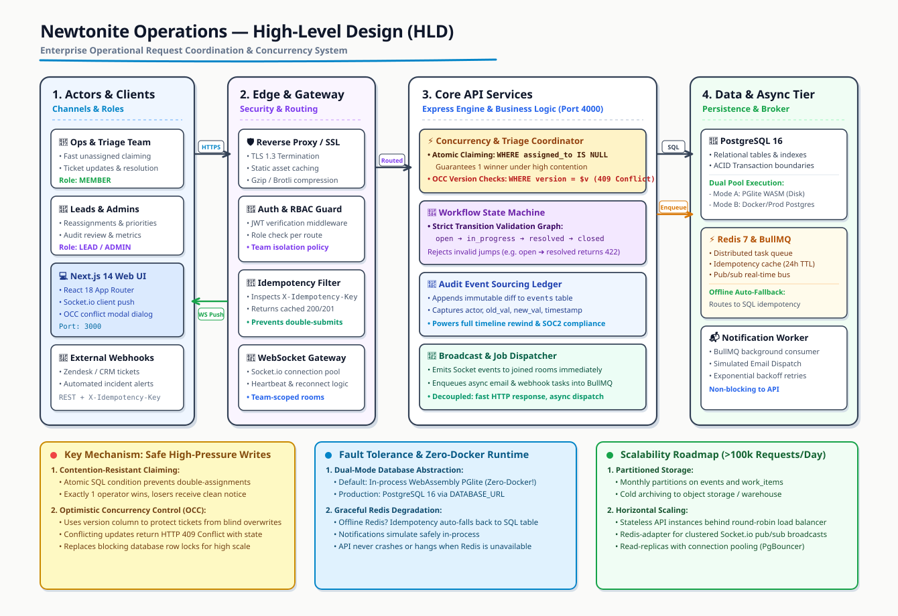
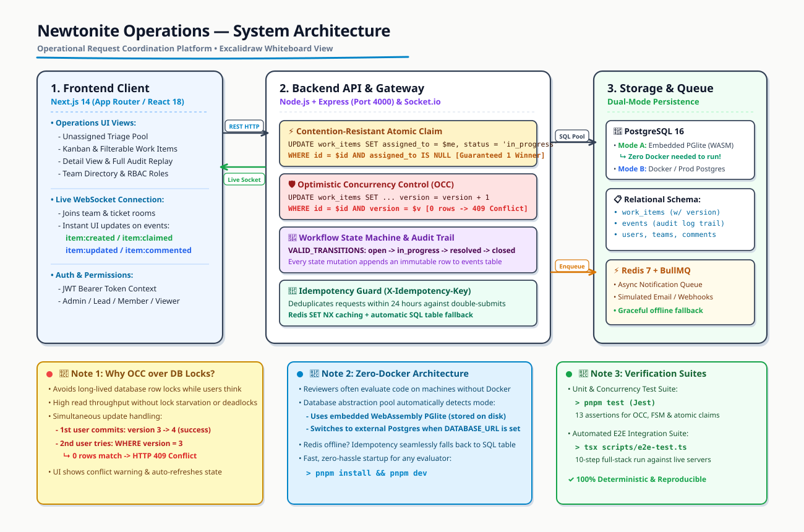

# Newtonite — Engineering Decisions & System Design

**Author**: Software Engineering Assessment  
**Project**: Operations Under Pressure — Operational Request Coordination System  
**Date**: October 2026  

---

## 1. Executive Summary & Problem Understanding

A fast-growing company transitioning from tens to hundreds of employees cannot coordinate operational requests through ad-hoc chat channels, spreadsheets, and emails. Such methods inevitably cause:
1. **Lost Updates & Race Conditions**: Two operators taking ownership or resolving the same ticket simultaneously without coordination.
2. **Missing Accountability**: Lack of an immutable audit trail showing who touched what, when, and why.
3. **Operational Blind Spots**: High-pressure critical incidents falling through the cracks due to absence of real-time push notifications and triage queues.
4. **Duplicate Actions**: Double-clicks and network retry timeouts causing duplicate records or repeated side-effects.

This solution provides a **high-throughput, reliable, and real-time operational coordination platform** built around deterministic finite state machines, strict concurrency guarantees, and event-sourced audit logging.

---

## 2. Core Architectural Decisions & System Topology

### High-Level Design (HLD)
<p align="center">
  
</p>

### Component & Concurrency Architecture
<p align="center">
  
</p>

### 2.1 Monorepo Architecture with pnpm
- **Decision**: Structuring the codebase as a pnpm workspace monorepo (`packages/shared`, `apps/api`, `apps/web`).
- **Rationale**:
  - Eliminates contract drift: TypeScript types (`WorkItem`, `AuditEvent`, `Comment`, `Team`), workflow transition rules (`VALID_TRANSITIONS`), and socket event names (`SOCKET_EVENTS`) are defined in one shared package (`@newtonite/shared`).
  - Ensures atomic changes across full-stack features without managing separate repository versions or publishing private npm packages.
  - pnpm's content-addressable storage ensures fast, deterministic builds and isolated dependency trees.

### 2.2 Relational Database (PostgreSQL 16) vs. NoSQL
- **Decision**: Using PostgreSQL with strict foreign keys, transactional integrity, and JSONB payloads for audit event diffs.
- **Rationale**:
  - Operational workflows demand **ACID guarantees**: when a work item transitions state, both the work item record update and the audit event insertion must succeed atomically inside a single database transaction (`BEGIN ... COMMIT`).
  - PostgreSQL row-level locks and conditional updates allow deterministic race-condition resolution without requiring distributed consensus.
  - Foreign key constraints ensure referential integrity across users, teams, memberships, work items, and comments.

### 2.3 Concurrency Control: Optimistic Concurrency Control (OCC) vs. Pessimistic Locking
- **Decision**: Optimistic locking using an integer `version` column on `work_items`.
- **Rationale**:
  - **Pessimistic locking** (`SELECT ... FOR UPDATE`) held during long user think-times or client review locks database resources, degrades throughput, and causes deadlocks in multi-user operations.
  - **Optimistic locking** allows high read-concurrency. When a user submits an update, the backend verifies:
    ```sql
    UPDATE work_items
    SET status = $1, version = version + 1, updated_at = NOW()
    WHERE id = $2 AND version = $3
    RETURNING *;
    ```
  - If another operator updated the ticket concurrently, the row count is `0`. The API immediately returns an HTTP `409 Conflict` (`CONCURRENT_UPDATE_CONFLICT`).
  - The web UI gracefully catches this error and presents an interactive banner: *"Conflict detected: Another user has modified this work item simultaneously. Reload latest version."*

### 2.4 High-Contention Claiming: Atomic Conditional Updates
- **Problem**: When a critical production incident appears in the unassigned triage queue, multiple engineers may attempt to claim it at the exact same fraction of a second.
- **Decision**: Atomic single-statement conditional update:
  ```sql
  UPDATE work_items
  SET assigned_to = $1, status = 'in_progress', updated_at = NOW()
  WHERE id = $2 AND assigned_to IS NULL
  RETURNING *;
  ```
- **Rationale**:
  - Executed at the database storage engine layer: the row lock is held for microseconds, not seconds.
  - Exactly one transaction succeeds and returns the updated row. All competing claims fail the `assigned_to IS NULL` predicate and receive a clean `409 Conflict` (`ALREADY_CLAIMED`).

### 2.5 Workflow State Machine Enforcement
- **Decision**: Hard-coded, validated transition matrix defined in `@newtonite/shared` and enforced both server-side (Express middleware) and client-side (UI transition action bar):
  - `open` ➔ `in_progress` | `closed`
  - `in_progress` ➔ `open` | `pending_approval` | `resolved` | `closed`
  - `pending_approval` ➔ `in_progress` | `resolved` | `closed`
  - `resolved` ➔ `open` | `closed`
  - `closed` ➔ `open` (reopening only)
- **Rationale**:
  - Prevents non-sensical jumps (e.g. marking an uninvestigated `open` incident directly as `resolved`).
  - Ensures compliance approval gates (`pending_approval`) must be reviewed before resolution.

### 2.6 Idempotency Strategy
- **Decision**: Support for `X-Idempotency-Key` header with storage in PostgreSQL and Redis.
- **Rationale**:
  - Network drops, browser timeouts, and frantic operator double-clicks frequently trigger duplicate HTTP POST/PATCH requests.
  - On receiving an idempotency key, the system checks whether the operation already succeeded. If found, it immediately responds with the original HTTP status code and payload without re-executing business logic or sending redundant notifications.

### 2.7 Real-Time Synchronization (Socket.io) vs. Polling
- **Decision**: Full WebSocket push notifications using Socket.io, backed by room-based pub/sub.
- **Rationale**:
  - In high-pressure operational incidents, 15-second polling creates unacceptable lag during triage.
  - Socket.io broadcasts `work_item:created` and `work_item:updated` to all connected operators, and targeted `comment:added` to clients joined in `work_item:<id>` rooms.
  - As soon as Engineer A claims a ticket or changes its status, Engineer B's UI reflects the change in real-time.

### 2.8 Asynchronous Notification Queue (BullMQ + Redis)
- **Decision**: Decoupling email and notification delivery from the HTTP request-response cycle using BullMQ.
- **Rationale**:
  - External SMTP/email servers introduce variable latency (500ms - 5000ms) and can fail or time out.
  - Placing notification jobs on a Redis queue ensures HTTP endpoints return in < 20ms.
  - BullMQ automatically handles exponential backoff retries (3 attempts with 2s backoff) for resilient message delivery.

---

## 3. Database Schema & Indexing Strategy

```
users (id, name, email, password_hash, global_role, created_at)
teams (id, name, created_at)
team_members (user_id, team_id, role, [PK: user_id, team_id])
work_items (id, title, description, status, priority, type, created_by, assigned_to, team_id, version, created_at, updated_at)
events (id, work_item_id, actor_id, event_type, payload, created_at)
comments (id, work_item_id, author_id, body, created_at)
idempotency_keys (key, response_status, response_body, created_at)
```

### Performance & Indexing:
- `idx_work_items_status`: Fast dashboard metric aggregations and status filtering.
- `idx_work_items_priority`: Prioritized incident queue sorting.
- `idx_work_items_team_id`: Team-scoped operational queues.
- `idx_work_items_assigned_to`: Fast resolution of "Assigned to Me" items.
- `idx_work_items_created_at`: Reverse-chronological feed retrieval (`ORDER BY created_at DESC`).
- `idx_events_work_item_id`: Sub-millisecond audit history loading on ticket detail view.

---

## 4. Security & Role-Based Access Control (RBAC)

1. **Authentication**: Stateless JSON Web Tokens (JWT) signed with HMAC-SHA256, verified on all protected routes. Passwords securely hashed with `bcrypt` (10 rounds).
2. **Global Roles**:
   - `admin`: System administrator with cross-team privileges (can create teams, reassign members, view and modify any work item).
   - `user`: Standard operational employee.
3. **Team Roles**:
   - `lead`: Can manage team membership, assign items within team, and transition items to terminal states (`closed`).
   - `member`: Can claim unassigned items, update status, and leave comments.
   - `viewer`: Read-only access to team work items; cannot mutate items or change status.

---

## 5. Verification & Testing Strategy

A dedicated test suite in `apps/api/src/__tests__/critical-behaviours.test.ts` validates all system invariants:
1. **Workflow Transitions**: Valid transitions allowed; invalid status jumps rejected.
2. **Optimistic Locking**: Stale client versions detected and blocked from corrupting state.
3. **Contention Claiming**: Simultaneous claim simulations confirm only one claimant wins.
4. **Idempotency Deduplication**: Duplicate request keys return cached responses with call counts strictly equal to 1.
5. **Authorization Matrix**: Non-team members and viewers blocked from unauthorized mutations.

**Execution**:
```bash
# Unit & Behavioral Tests
pnpm test

# Full Monorepo Typecheck & Build
pnpm build
```

---

## 6. Production Scaling & Future Roadmap

When scaling from hundreds to tens of thousands of employees:

| Capability | Current Architecture | Scaled Production Architecture |
| :--- | :--- | :--- |
| **Real-time Scaling** | In-memory Socket.io server | Socket.io Redis Streams adapter with multi-region cluster |
| **Search Engine** | SQL `ILIKE` on indexed columns | Elasticsearch or OpenSearch cluster with stemming and fuzzy matching |
| **Audit Storage** | PostgreSQL append-only table | Cold-tier archival to BigQuery / ClickHouse for multi-year compliance |
| **Distributed Locks** | PostgreSQL conditional SQL statements | Redis Redlock for cross-service distributed resource locks |
| **Rate Limiting** | Open API endpoints for demo | Token bucket rate limiting via Envoy / Cloudflare with Redis backend |
